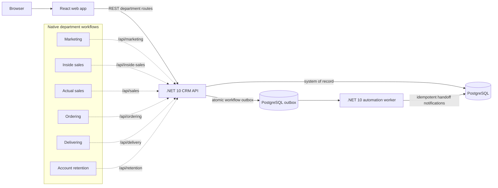

# Continuum CRM: customer lifecycle demo

This starter implements the supplied **Lifecycle Enterprise CRM Platform** design as a small, runnable reference application. It follows one customer from marketing intake through qualification, sales, order processing, delivery, and retention. Every department works with the same CRM customer profile.

The project is intended for learning and architecture discussion. It is not a production CRM or a production-ready cloud deployment.

## Public portfolio demo

**GitHub Pages demo:** [https://bryarcole.github.io/lifecycle-crm-platform/](https://bryarcole.github.io/lifecycle-crm-platform/)

The Pages site is a static, browser-only showcase. It generates 25,000 fictional accounts from the checked-in Census receipt-size benchmark; lifecycle actions are simulated and saved only in that browser's local storage. It does not connect to PostgreSQL, the .NET API, or the background worker. This keeps the portfolio URL safe to share without exposing a database or credentials.

The full-stack .NET API, PostgreSQL schema, worker, seeder, Compose setup, tests, and AWS/Azure examples remain in the repository for code review and local/cloud deployment. GitHub Actions rebuilds and republishes the Pages demo when frontend or benchmark files change on `main`.

## Industry-scale demo data

The CRM can be populated with exactly 25,000 fictional company accounts based on published U.S. Census firm counts and annual receipts-size bands for furniture retailers (including mattress stores) and mattress manufacturers. The source distribution is visible in the **Account revenue distribution** dashboard panel. The records are synthetic; all email addresses use the reserved `.example` domain. Details, source links, assumptions, and caveats are in [docs/customer-data.md](docs/customer-data.md).

The seed command replaces customers in its target database and cascades removal to their events, orders, notifications, and outbox messages. Use it only against a disposable demo database:

```sh
DATABASE_URL='Host=localhost;Port=5432;Database=lifecycle_crm;Username=crm_app;Password=local_only_change_me' npm run seed:customers -- --count=25000 --reset
```

## Run it locally

### Prerequisites

- .NET 10 SDK or Docker Desktop with Docker Compose v2
- Node.js 22 or newer for the React development server
- A browser

### Start the application

From the repository root:

```sh
cp .env.example .env
```

The sample password is for local development only. The Compose stack runs a React/Nginx frontend, a .NET CRM API, a separate .NET outbox worker, and PostgreSQL:

```sh
docker compose up --build
```

Open [http://localhost:3000](http://localhost:3000). The first start builds the .NET and frontend images and may take a few minutes. Compose publishes PostgreSQL on host port 5433 by default to avoid conflicting with a locally installed PostgreSQL server.

The default first run includes six walkthrough profiles. To replace them with the 25,000 synthetic industry profiles, wait for the API to start and run the .NET seeder from the repository root:

```sh
DATABASE_URL='Host=localhost;Port=5433;Database=lifecycle_crm;Username=crm_app;Password=local_only_change_me' npm run seed:customers -- --count=25000 --reset
```

This profile resets all customer-owned demo rows before it loads the Census-based accounts. Do not run it against a database containing data you need to retain.

To stop the stack, press Ctrl+C and run:

```sh
docker compose down
```

Customer records persist in a local Docker volume. To remove the database and all demo data as well, run `docker compose down -v`.

### Run against an existing local PostgreSQL

With `lifecycle_crm` and its application role already created, run these in separate terminals:

```sh
ASPNETCORE_URLS=http://localhost:4201 ConnectionStrings__Crm='Host=localhost;Port=5432;Database=lifecycle_crm;Username=crm_app;Password=local_only_change_me' npm run dev:api
```

```sh
ASPNETCORE_URLS=http://localhost:4202 ConnectionStrings__Crm='Host=localhost;Port=5432;Database=lifecycle_crm;Username=crm_app;Password=local_only_change_me' npm run dev:worker
```

```sh
npm run dev:web
```

Vite proxies `/api` directly to the .NET API on port 4201. On startup, the API applies the idempotent schema and only creates walkthrough profiles if the customer table is empty; it never replaces existing customer data.

### Walk through the lifecycle

1. In **Marketing**, use **Capture lead** to create a profile or select the sample lead. Mark it engaged.
2. Open **Inside sales** and qualify the warm lead.
3. Open **Actual sales** and close the opportunity as won.
4. In **Ordering**, create an order ticket.
5. In **Delivering**, confirm delivery.
6. In **Account retention**, start a renewal or create a cross-sell lead. The cross-sell returns to Marketing.

Each action updates the central customer record, appends an audit event, and writes an outbox message in the same database transaction. The automation worker consumes outbox messages and creates department handoff notifications. The department queue is driven by the profile's lifecycle stage.

## Architecture



### Services

| Component | Responsibility | Local port |
| --- | --- | ---: |
| Web | React + Vite lifecycle workspace; served by Nginx in Docker | 3000 |
| CRM API | ASP.NET Core 10 REST API, CRM system of record, and native department route groups | 8080 in Docker; 4201 locally |
| Automation worker | Separate .NET 10 worker process; consumes outbox records and persists handoff notifications | Internal 8080 in Docker; 4202 locally |
| PostgreSQL | Demo system-of-record database and automation outbox | Internal 5432 |

The six departments are bounded workflows exposed through route groups in one CRM API, not six copies of a pass-through service. The API alone owns customer and lifecycle writes. The outbox worker is a separate deployable process with the same PostgreSQL connection and restricted responsibility for handoff notifications. This follows the supplied front-heavy, single-CRM-system-of-record design while avoiding unnecessary network hops and duplicated service code.

### Lifecycle state transitions

| Department | Queue stage | Example action | Next stage |
| --- | --- | --- | --- |
| Marketing | New lead | Mark engaged | Warm lead |
| Inside sales | Warm lead | Qualify | Qualified |
| Actual sales | Qualified | Close won | Closed won |
| Ordering | Closed won or renewal due | Create order | Awaiting delivery |
| Delivering | Awaiting delivery | Confirm delivery | Active customer |
| Account retention | Active customer | Start renewal | Renewal due |
| Account retention | Active customer | Create cross-sell lead | New lead |

The CRM validates the department and current state for each transition. Invalid or out-of-order commands return an error instead of silently skipping a handoff.

## API quick reference

All browser/API traffic goes directly to the .NET CRM API. In the local Compose setup, only the API and web frontend are exposed; PostgreSQL and the automation worker remain private to the Docker network.

| Method | Route | Purpose |
| --- | --- | --- |
| `GET` | `/api/dashboard` | Database-aggregated customer count, stage counts, historical funnel, annual receipts, and revenue bands |
| `GET` | `/api/events` | `{ "events": [...] }` recent lifecycle audit history |
| `GET` | `/api/notifications` | `{ "notifications": [...] }` handoff notifications from the worker |
| `GET` | `/api/{department}/queue` | Queue for marketing, inside-sales, sales, ordering, delivery, or retention |
| `POST` | `/api/{department}/actions` | Capture a lead or perform an allowed lifecycle action |
| `GET` | `/health` | CRM API health check |

For example, `POST /api/marketing/actions` with `{"action":"capture_lead","name":"Sam Rivera","email":"sam@example.com","company":"Example Co","campaign":"Spring launch","estimatedValue":12000}` creates a new CRM profile. Department actions use an `action` and `customerId`, such as `{"action":"qualify","customerId":"<profile-id>"}`.

## Run checks without Docker

Requirements: .NET SDK 10, Node.js 22 or newer, and a running PostgreSQL 16 database. Install the frontend dependencies, then run checks:

```sh
npm --prefix apps/web install
npm test
npm run check
npm run build:web
```

The direct-run example above shows the PostgreSQL connection string configuration. Docker Compose provides an isolated database and service network for repeatable setup.

## Preliminary cloud infrastructure

Pushing source code to GitHub does not run the CRM. GitHub Pages can only host a static frontend and cannot host this project's API, background worker, or PostgreSQL database. Use the included AWS or Azure container infrastructure for an actual client-accessible deployment; configure TLS, identity/RBAC, secrets, database networking, and a reviewed budget before exposing it.

Terraform examples are provided for both **AWS** and **Azure**. They are intentionally disabled by default; planning/applying them with defaults does not launch application compute. Review each cloud folder's README before enabling deployment.

- AWS: preliminary ECR, ECS/Fargate, Service Connect, CloudWatch, and ALB setup for separate web, .NET API, and .NET worker images.
- Azure: preliminary Container Apps setup for separate web, .NET API, and .NET worker images, with internal API/worker ingress.
- Neither example creates a managed PostgreSQL server. Use a managed PostgreSQL offering in a private network and pass its connection string through the cloud secret service. The Azure example currently accepts the connection string as a sensitive Terraform variable; Terraform state must therefore be encrypted and access-controlled.
- The AWS HTTP listener is a bootstrap only. Add TLS with an ACM certificate, HTTPS listener, DNS, WAF/rate limiting, alarms, autoscaling policies, and private network endpoints before any production exposure.
- Cloud cost depends on region, network egress, logs, database sizing, and replica count. Keep `deploy_enabled = false` until images, networking, secrets, and an estimated budget are ready.

See [infra/aws/README.md](infra/aws/README.md) and [infra/azure/README.md](infra/azure/README.md) for setup sequence and required variables.

## Security, scaling, and production gaps

This is a lower-level design example, not a secure production implementation. In particular:

- Department navigation is presentation-only. Add OIDC/SSO, API authorization, and server-enforced RBAC for the six roles.
- Replace the local Compose password and protect all credentials in a managed secret store. Do not commit `.env` or Terraform state.
- The demo uses one central CRM database because the source design requires one CRM system of record. Only CRM owns customer/lifecycle writes; the worker owns generated handoff notifications. For stronger domain boundaries, split schemas gradually and retain a public CRM API.
- The .NET automation worker uses PostgreSQL `FOR UPDATE SKIP LOCKED` polling as a minimal outbox consumer. It retries failed batches and emits structured logs. Add poison-message handling, metrics, and a managed broker (for example, SQS/EventBridge or Azure Service Bus) if throughput or delivery guarantees require it.
- Lead/order amounts, campaigns, and fulfillment are illustrative. Payment, inventory, email, shipping, contract storage, renewal policies, and external APIs are not integrated.
- REST is implemented. GraphQL, comprehensive reporting, audit retention policies, data encryption/key rotation, backups, disaster recovery, rate limits, and load tests are future work.

## Project layout

- `apps/web` — React + TypeScript client and production Nginx image
- `src/Lifecycle.Api` — ASP.NET Core CRM API and department routes
- `src/Lifecycle.Core` — lifecycle domain, application services, Npgsql repository, and Census generator
- `src/Lifecycle.Worker` — independent transactional-outbox notification worker
- `src/Lifecycle.Seeder` — opt-in PostgreSQL synthetic customer data loader
- `tests/Lifecycle.Tests` — workflow and Census data unit tests
- `Dockerfile.dotnet` — shared .NET multi-stage image build for API, worker, or seeder
- `db/init.sql` — initial PostgreSQL schema
- `infra/aws` and `infra/azure` — preliminary Terraform deployment examples
- `tests` — lifecycle transition unit tests
- `docs/design-decisions.md` — mapping from the supplied design to this example
