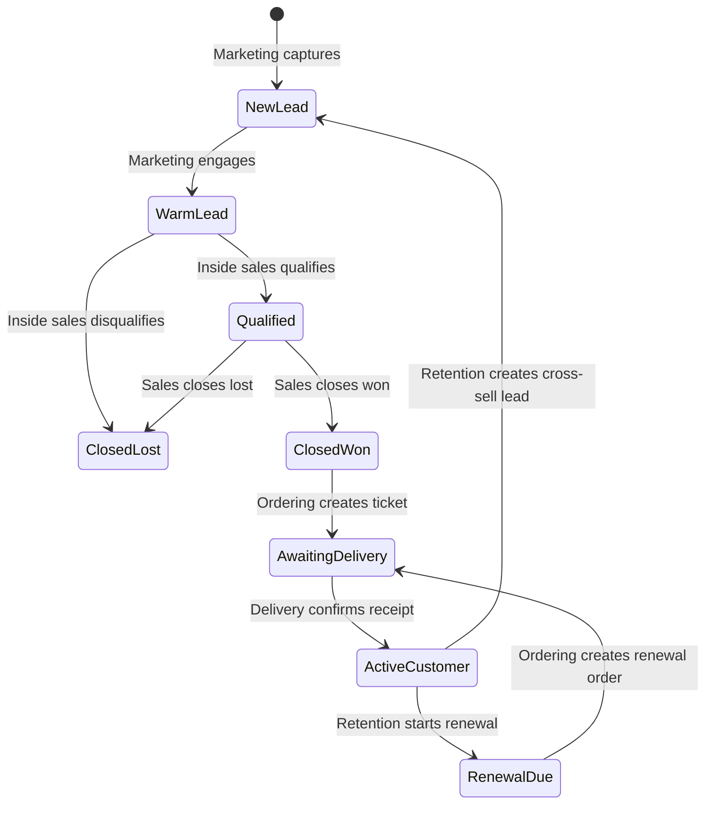

# Design document mapping

This note records how the supplied Lifecycle Enterprise CRM Platform draft is represented in the runnable demo. The source calls for one customer identity, six departmental workspaces, automated handoffs, an API-first design, and lifecycle analytics.

## Requirements mapped to the example

| Source design requirement | Example implementation |
| --- | --- |
| One customer ID and CRM system of record | `customers` table in PostgreSQL; customer records are only changed by the CRM service. |
| Six department dashboards | One UI workspace per department, backed by six independently configured department-service containers. |
| Marketing creates and engages leads | Lead capture creates a `new_lead`; engagement advances it to `warm_lead`. |
| Inside sales qualifies warm leads | Qualification advances a warm lead to `qualified`; disqualification ends the lifecycle. |
| Actual sales closes qualified opportunities | Won deals advance to `closed_won`; lost deals advance to `closed_lost`. |
| Ordering queues closed deals and renewals | The Ordering queue accepts `closed_won` or `renewal_due`; creating an order stores an order ticket and advances the profile. |
| Delivery tracks fulfillment | The delivery action updates the order status and moves the profile to `active_customer`. |
| Retention renews or cross-sells | Renewal routes back to Ordering; cross-sell routes to Marketing. |
| Automated state changes and routing | CRM validates and persists each transition with its audit event and outbox message in one transaction. An automation worker consumes the outbox and persists a department notification. |
| Horizontal conversion reporting | The CRM API reports current stage counts and historical distinct-profile funnel counts derived from audit events. |
| REST / integration access | All browser-facing requests use the API gateway. The CRM service exposes stable REST endpoints; no external provider adapter is enabled in the demo. |
| Azure or AWS deployment direction | Optional Terraform examples map the containerized services to Azure Container Apps or AWS ECS/Fargate. |

## Lifecycle and handoff outline

For every transition, CRM writes the customer update, audit event, and outbox item atomically. The automation worker locks pending outbox rows with `FOR UPDATE SKIP LOCKED`, creates a deduplicated handoff notification, and marks the message processed. This provides a compact, durable demonstration without adding a broker to the local stack.

## Deliberate boundaries

- The design document explicitly prioritizes a centralized CRM database. Therefore department services call CRM APIs and do not own customer tables. This differs from database-per-service guidance, which normally improves service autonomy but would weaken the requested single-source-of-truth example.
- The role-specific service code is shared and parameterized to avoid six copies of identical validation and forwarding logic. Compose and Terraform still deploy each role as its own service instance.
- Department queues are projections of the CRM lifecycle stage, not independently mutable task queues. Notifications are persisted separately by the automation worker.
- Campaign attribution is stored as a label on the profile. Campaign planning, email delivery, inventory, billing, logistics provider integrations, and contract workflows remain out of scope for the starter.
- The customer and order persistence is real PostgreSQL persistence. Authentication, authorization, GraphQL, and production-grade operations are intentionally not represented as complete features.
